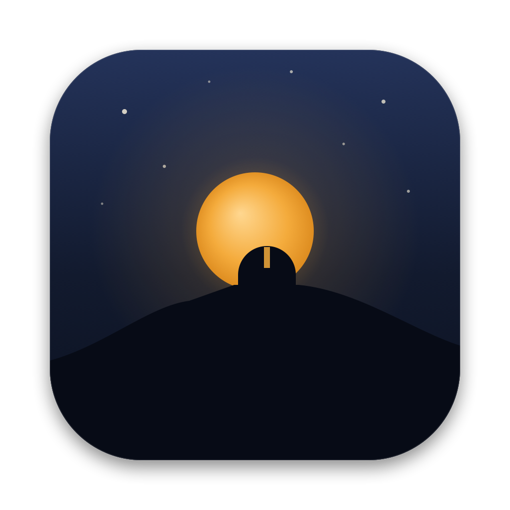
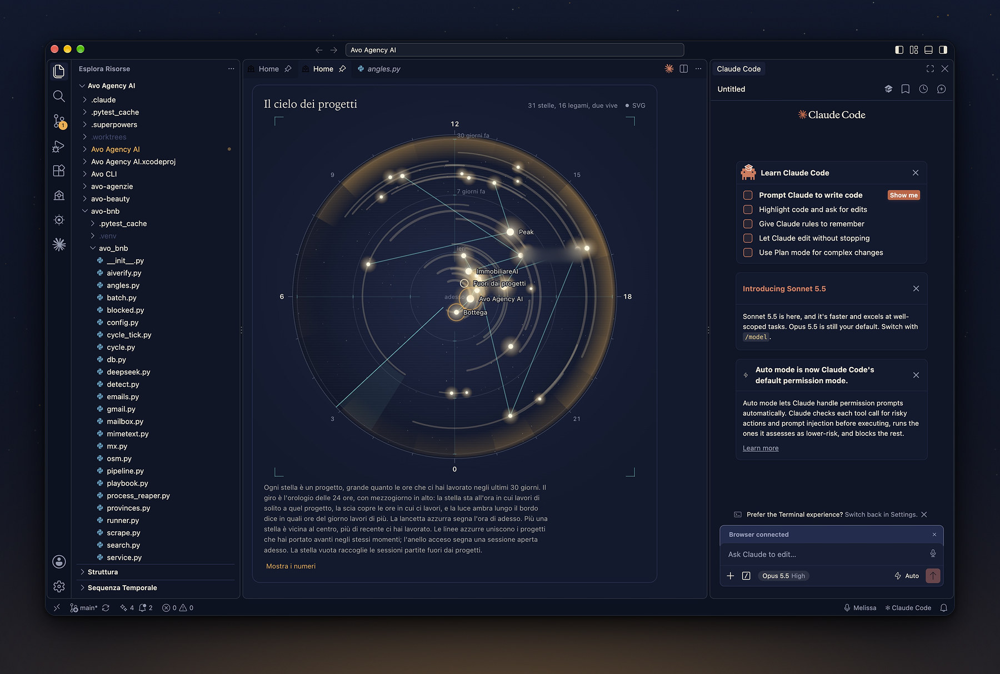
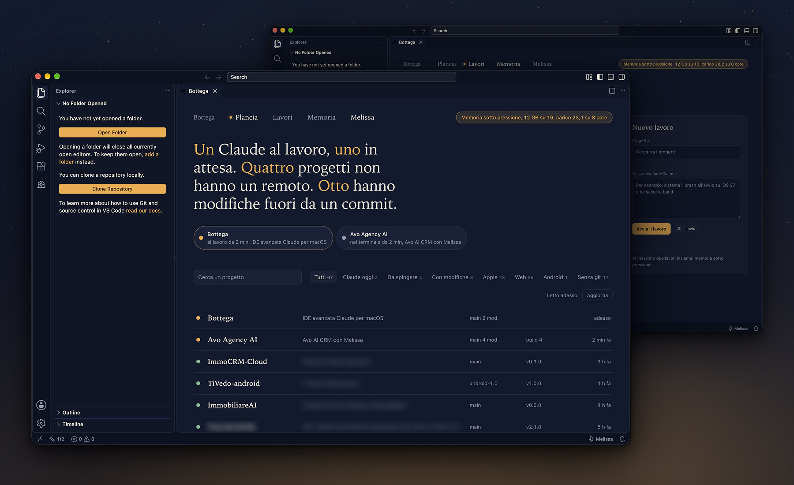
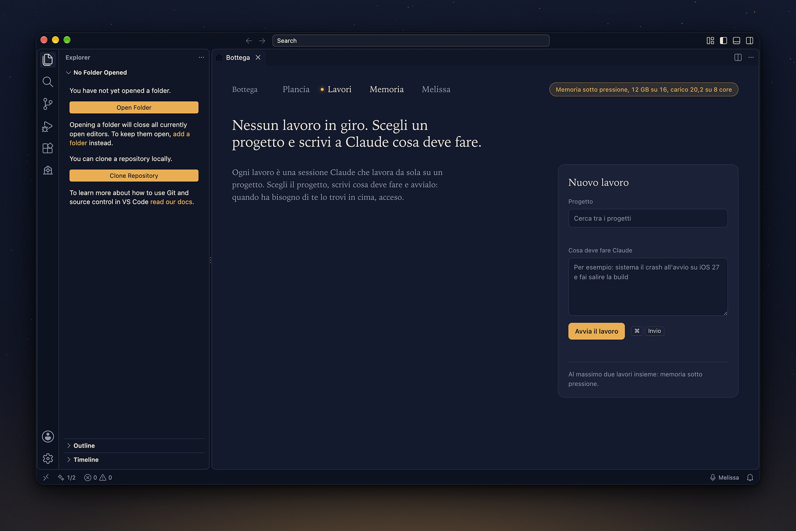
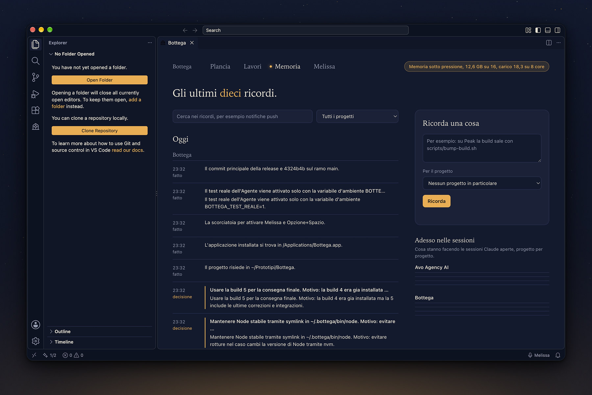
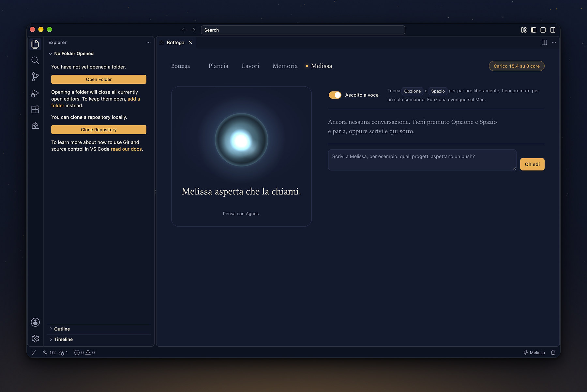
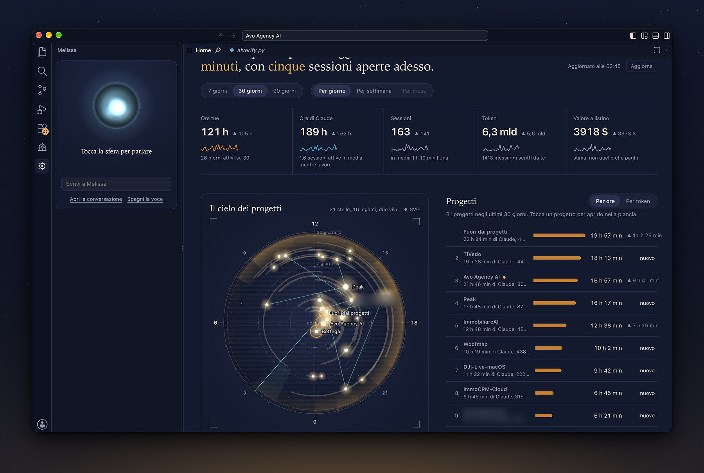
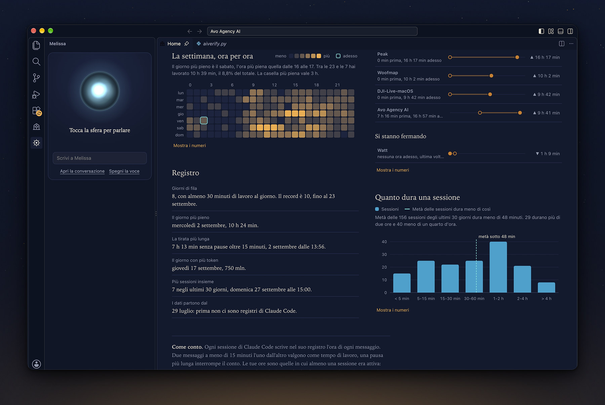
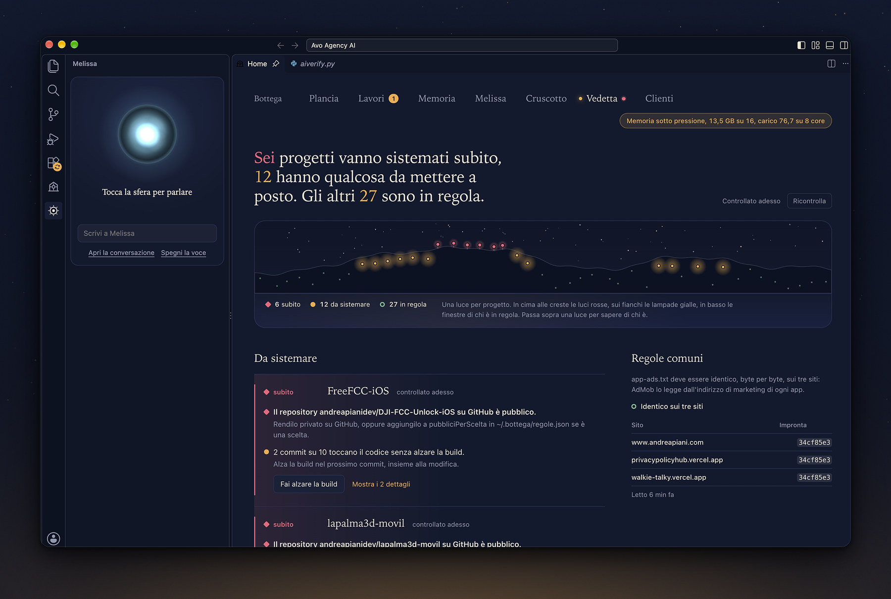

<p align="center">
  
</p>

<h1 align="center">Bottega</h1>

<p align="center">
  Un IDE per lavorare con Claude Code, costruito su VS Code e cucito addosso al Mac.<br>
  Tutti i tuoi progetti su una plancia, piu' sessioni Claude in parallelo, una memoria che si
  ricorda cosa avete fatto, e Melissa: un'assistente a cui parli.
</p>

<p align="center">
  Apple Silicon, macOS 27 o successivo. Open source, licenza MIT. Progetto personale in fase alfa.
</p>



## Perche' esiste

Chi lavora con Claude Code finisce presto con dieci terminali aperti, sessioni sparse in cartelle
diverse e nessuna idea di quale progetto aspetti un push o quale sessione ti stia aspettando.
La Bottega mette tutto in un posto solo: vede ogni progetto e ogni sessione Claude del Mac, ti dice
in una frase com'e' la situazione e ti lascia lavorare a voce.

La Bottega e' VS Code 1.140 compilato dai sorgenti ufficiali Microsoft (licenza MIT), con poche patch
mirate e quattro pezzi propri.

## Cosa c'e' dentro

### La plancia



All'avvio, al posto della pagina di benvenuto, una frase dice com'e' la situazione: quante sessioni
Claude lavorano, quali progetti aspettano un push, quali hanno modifiche fuori da un commit. Sotto,
le sessioni Claude aperte in tutto il Mac (respirano quando lavorano) e l'elenco dei progetti con
stato git, numero di build letto dal progetto Xcode o Android, e lo storico delle sessioni Claude di
ciascuno, da riprendere con un clic.

### I lavori



Piu' sessioni Claude in parallelo, ognuna in una scheda dell'editor. Scegli il progetto, scrivi cosa
deve fare Claude, avvia. Quando un lavoro ha bisogno di te diventa la cosa piu' luminosa della
pagina e arriva una notifica di macOS. Una coda rispetta i limiti del Mac: con 16 GB lavorano al
massimo tre sessioni insieme, meno se la memoria e' sotto pressione o il Mac e' caldo. Nella stanza Lavori
compaiono anche le sessioni Claude aperte fuori dalla Bottega (un terminale, un'altra app): ogni sessione viva è un
lavoro, e tutti i numeri della Bottega li contano allo stesso modo.

### La memoria



La nostra versione di [claude-mem](https://github.com/thedotmack/claude-mem). Gli hook di Claude
Code registrano ogni sessione; a intervalli un modello la riassume in italiano, con fatti e decisioni
separati. Ogni nuova sessione parte sapendo cosa e' stato fatto su quel progetto, e Claude puo'
cercare nella memoria con il server MCP `bottega-memoria`.

Le sessioni che girano nello stesso momento si vedono a vicenda: se due sessioni lavorano sullo
stesso progetto, ognuna sa cosa ha appena toccato l'altra (la bacheca), e viene avvisata se sta per
mettere le mani su un file che l'altra ha modificato da poco.

### Melissa



Un'assistente vocale con un carattere suo, che agisce sull'IDE: apre progetti, avvia lavori Claude,
cerca nella memoria, legge lo stato di git e del sistema. Tocca **Opzione+Spazio** per una
conversazione in tempo reale (mentre parla non ti ascolta, come la Melissa di Avo: la interrompi con un tocco),
tienilo premuto per un comando solo. Funziona ovunque sul Mac, anche con la Bottega in secondo piano. Le azioni a rischio, come un
push, chiedono sempre conferma.

- Ascolto: il riconoscimento vocale di Apple sul Mac (`SFSpeechRecognizer`, italiano), come la Melissa di Avo:
  testo in diretta mentre parli, frase chiusa dopo 1,8 secondi senza parole nuove. Al primo uso macOS chiede
  i permessi di microfono e riconoscimento vocale.
- Ragionamento: Agnes AI (`agnes-3.0-flash`, API compatibile OpenAI) con strumenti, in streaming,
  cosi' Melissa comincia a parlare mentre la risposta e' ancora in arrivo. A voce senza ragionamento
  (`reasoning_effort: none`), per rispondere subito; l'impegno scelto nella barra vale per le domande scritte.
- Voce: ElevenLabs `eleven_v4_turbo` su canale tenuto caldo, circa 0,2 secondi al primo suono.
  Se ElevenLabs non risponde, parla con una voce di sistema di macOS.
- La sfera vive dentro la Bottega, nella barra laterale e nella barra di stato. Con `bottega.voice.sfera` su
  `schermo` torna la sfera disegnata in Metal dal Nucleo, in un pannello di vetro sopra le finestre.

### Il Nucleo

Un'app Swift nativa nascosta dentro la Bottega (`nucleo/`), per tutto quello che Electron non sa
fare: audio, sfera Metal, scorciatoia globale, notifiche, icona nella barra dei menu, pressione di
memoria e temperatura del Mac, Apple Intelligence (FoundationModels) ed embedding di frase
(NaturalLanguage). Solo framework Apple, nessuna dipendenza esterna. Da fermo: 0% di CPU, circa
40 MB di memoria, nessuna connessione aperta.

Apple Intelligence fa solo lavori brevi e strutturati, tutti sul Mac: è il cervello di riserva di Melissa, **con gli
strumenti** (apre progetti, legge lavori e regole, cerca nella memoria, chiede conferma per push e stop), e prende il
turno all'istante quando Agnes non risponde; classifica ogni sessione in correzione, funzione, rilascio, ricerca,
manutenzione o documentazione, e il cruscotto ne ricava frasi come «questa settimana 60% correzioni». Un solo motore
Metal disegna la sfera di Melissa, che respira più in fretta quando più sessioni Claude lavorano, e il cielo
dell'Osservatorio, sempre e solo quando è visibile.

Vision legge il testo sul Mac: le schermate incollate nelle sessioni Claude diventano cercabili nella memoria (ripulite
dalle chiavi, le immagini non si salvano), e a richiesta («Melissa, guarda») Melissa legge lo schermo: le arriva solo il
testo.

### L'Osservatorio

Una finestra nativa, SwiftUI e Metal con il vetro di macOS 27: il cielo dei progetti, una stella per progetto che
cresce e si scalda con le ore e pulsa quando Claude ci scrive, e sopra i pannelli con oggi, la settimana, quando lavori
(una superficie 3D di Swift Charts da girare col mouse), i token per progetto e che lavoro è stato. Pensata anche per un
secondo schermo. Si apre dalla Bottega (comando «Apri l'Osservatorio»), dalla barra dei menu, da Siri e dal Centro di
Controllo.

### Il cruscotto



Quanto lavori, letto dai registri che Claude Code scrive sul Mac, senza niente da configurare. In cima le tue ore,
le ore di Claude (che crescono quando lavorano più sessioni insieme), le sessioni, i token e il valore a listino, cioè
quanto costerebbero quei token alle tariffe delle API: una stima, non quello che paghi con un abbonamento. Ogni numero
ha accanto il periodo prima e una piccola curva, su 7, 30 o 90 giorni.

Il cielo dei progetti è un orologio di 24 ore: ogni stella è un progetto, grande quanto le ore che ci hai messo, più
vicina al centro quanto più di recente ci hai lavorato, e la sua scia copre le ore del giorno in cui ci lavori di
solito. Le linee uniscono i progetti portati avanti negli stessi momenti, l'anello acceso segna una sessione aperta
adesso.



Più in basso la settimana ora per ora, i progetti che stanno partendo e quelli che si stanno fermando, quanto dura una
sessione, e il registro: giorni di fila, il giorno più pieno, la tirata più lunga senza pause. In fondo, scritto in
chiaro, come si contano le ore.

### La Home

La plancia è la Home dell'app: una scheda appuntata che si apre sempre, anche con una cartella aperta, e che si
ritrova al riavvio. In cima il briefing del giorno e i consigli scritti da Apple Intelligence sul Mac (senza Apple
Intelligence restano consigli fissi ricavati dalle regole), poi i numeri che contano, i progetti dimenticati e l'elenco
dei progetti con il loro semaforo.

### Il semaforo delle regole e la Vedetta



Ogni progetto ha un semaforo che si accende quando una regola è violata: un commit che tocca il codice di un'app senza
far salire il numero di build, commit non spinti, repository senza remoto, repository pubblici non voluti, chiavi nei
commit non ancora spinti, una versione su App Store Connect che non andrà in rilascio automatico, `app-ads.txt` diverso
tra i siti che lo servono. Per ogni violazione c'è la frase che dice come rimediare e, quando si può, il pulsante che lo
fa. La stanza Vedetta mette tutto insieme, accanto al radar dello Store: stato di ogni app su App Store Connect,
ultime recensioni e quanto ha reso su AdMob ieri e negli ultimi sette giorni. La Vedetta guarda anche i siti: per ogni
progetto collegato a Vercel mostra l'ultima pubblicazione di produzione (pronta, in costruzione o fallita), il dominio e
da quanto tempo, con la CLI di Vercel già collegata, in sola lettura e senza chiavi nuove; una pubblicazione fallita
accende di rosso il semaforo del progetto. Funziona anche senza rete, con l'età del dato in chiaro. Le chiavi si leggono
da `~/.secrets/` e dal server MCP di AdMob già autenticato: nel repository non c'è niente.

### Il briefing del mattino, la notte, «continua da dove eri»

Alla prima apertura della giornata Melissa dice in trenta secondi cosa conta: ore e progetti di ieri, lavori che
aspettano, novità dallo Store, soldi di ieri, regole violate, progetti dimenticati, cosa è successo stanotte. Una volta
sola, poi resta una card nella Home. I lavori si possono mettere in fila per la notte: partono nella finestra scelta
(di default dall'una alle sei), uno o due alla volta, solo se il Mac è alla corrente e la memoria è tranquilla; il
Nucleo tiene sveglio il Mac mentre lavorano e il loro prompt vieta push e pubblicazioni. Su ogni progetto, «Continua da
dove eri» prepara un lavoro che riparte dall'ultimo riassunto della memoria e dalle cose rimaste da fare: il prompt si
legge e si cambia prima di partire.

### Ore per cliente e «Dove l'ho già risolto?»

La stanza Clienti raggruppa le ore del cruscotto per cliente (l'associazione progetto e cliente sta in
`~/.bottega/clienti.json`, solo sul tuo Mac), arrotonda ogni giorno al quarto d'ora ed esporta il mese in CSV e in
Markdown. «Dove l'ho già risolto?» cerca per significato in tutta la memoria e per testo nel codice di tutti i progetti.

### Connettori e posta per progetto

La Bottega non ha chiavi di Gmail, Vercel o altri servizi: usa i connettori che hai già in Claude Code, quindi
funziona per chiunque scarichi il progetto. Si aggiungono in Claude Code: i connettori di claude.ai (Gmail, Google
Calendar, Google Drive, Vercel, Stripe) dalle impostazioni di claude.ai, i server locali con `claude mcp add`. La stanza
Connettori mostra cosa hai e cosa si accende nella Bottega: posta, calendario, pubblicazioni, Store, file, pagamenti,
pubblicità, motori di ricerca, messaggi. Un connettore collegato il cui controllo è solo scaduto resta collegato, con
una nota; i plugin non collegati stanno in un riquadro chiuso in fondo.

La prima capacità accesa è la posta per progetto. Una rubrica dice quali mittenti, domini, numeri di telefono e gruppi
WhatsApp sono di quale progetto; un pulsante legge la posta degli ultimi giorni e la divide per progetto, e chi non è in
rubrica finisce in «Da assegnare». Lì la Bottega propone il progetto giusto per i mittenti nuovi, con il motivo («il
dominio è nel README», «l'oggetto cita il nome del progetto»), e lascia fuori i mittenti automatici (noreply,
notifiche, newsletter); i domini che compaiono nei file di più progetti sono di fornitori e non vengono proposti. Un
server di posta locale (per esempio un server MCP per Apple Mail) si interroga direttamente, gratis e in pochi secondi.
Gmail di claude.ai passa da una delega a Claude Code senza finestra, che carica solo il connettore Gmail: costa da 8 a
80 secondi e da 0,02 a 0,08 dollari, e c'è comunque un tetto di spesa giornaliero
(`bottega.connettori.tettoGiornalieroUsd`, 1 dollaro).

Accanto ai fili di posta, ogni progetto mostra le chat WhatsApp dei suoi contatti, se hai in Claude Code i server
locali di WhatsApp: tutte quelle del numero business, e di quello personale solo i numeri e i gruppi che hai messo in
rubrica. Per ogni chat c'è il contatto, l'ultimo messaggio accorciato, chi ha scritto per ultimo e un pulsante che la
apre in WhatsApp sul Mac.

Privacy. Il contenuto delle mail lette da Gmail passa da Claude e da Anthropic, come nell'uso normale dei connettori;
con la fonte locale mittente, oggetto e data restano sul Mac. Delle chat WhatsApp si tiene solo l'anteprima
dell'ultimo messaggio, e le chat personali fuori rubrica non vengono nemmeno scritte su disco. La rubrica
(`~/.bottega/rubrica.json`) e la cache di fili e chat (`~/.bottega/connettori/`) restano sul tuo Mac, mai nel
repository. La Bottega usa solo strumenti di lettura, e lascia fuori anche quelli che leggono codici, certificati o
password: nessuna mail o messaggio viene mai inviato, nessuna bozza creata, niente spostato o cancellato.

### Melissa dentro l'IDE

Melissa vive nella barra laterale destra della Bottega, sempre aperta, e nella barra di stato: non sopra le altre app.
La barra è il suo centro di controllo: la sfera, la conversazione, tutte le sessioni Claude del Mac (chi lavora, chi ti
aspetta, cosa sta facendo), comandi rapidi, e in testa il cervello con cui pensa e i conti dei servizi. Il cervello è
sempre Agnes; per una conversazione puoi scegliere Claude, Gemini o GPT via OpenRouter, Apple Intelligence o DeepSeek,
anche a voce («usa Claude», «pensa più a fondo»), e alla fine si torna ad Agnes da soli. I conti dicono solo cose
vere: il saldo di OpenRouter e DeepSeek letto dai servizi, le richieste di oggi ad Agnes (che non ha un saldo) e i
caratteri di voce contati dalla Bottega. Melissa legge cosa hanno fatto le sessioni, passa istruzioni ai lavori della
Bottega, avvisa quando uno ti aspetta e muove il cruscotto mentre ti risponde («fammi vedere le ore di Woofmap questa
settimana»). Usa anche i connettori che hai in Claude Code, sempre in sola lettura: legge da sola e gratis i server
locali (AdMob, Search Console, App Store Connect...), chiede a Claude per Gmail, Calendar, Drive o Vercel solo dopo
averti detto tempo e costo, e la mattina mette nel briefing gli appuntamenti di oggi. Chi vuole la sfera sullo schermo, come prima, imposta `bottega.voice.sfera` su `schermo`. Il Nucleo espone anche i Comandi rapidi
(«Chiedi a Melissa», «Avvia un lavoro», «Briefing», «Stato delle regole», anche con Siri), due widget da scrivania
(il semaforo con il briefing, e «Oggi» con le ore, il grafico della settimana, chi ti aspetta e tre pulsanti), quattro
controlli per il Centro di Controllo (Melissa, plancia, nuovo lavoro, Osservatorio), e mette progetti e ricordi in
Spotlight (se l'indicizzazione di Spotlight è accesa sul Mac). Siri conosce i progetti per nome: «Apri Woofmap nella
Bottega», «Che progetti aspettano un push su Bottega», «Cosa mi aspetta su Bottega».

### L'aspetto

La Bottega è la bottega di un artigiano del software: un banco di lavoro, una lampada accesa sopra il banco, di
notte, quando fuori è buio e si lavora meglio. I temi Bottega Notte e Bottega Calima hanno i colori di quella stanza:
il blu della notte fuori dalla finestra e l'ambra della lampada, che si accende solo dove serve, cioè dove qualcuno
sta lavorando o dove c'è da mettere le mani. L'icona è il banco stesso: la lampada da bottega, il portatile con il
codice, il martello appoggiato accanto. Titoli senza maiuscolo forzato, schede e finestre arrotondate. Copilot non
è incluso: la Bottega lavora con Claude Code.

### La Bottega per iPhone

Melissa e i lavori del Mac in tasca, anche fuori casa. L'app per iPhone (`ios/`) ha la stessa icona e la stessa
sfera: gli stessi file Metal del Nucleo, compilati anche per iOS. Tocchi la sfera e parli. L'iPhone ti sente con il
riconoscimento vocale di Apple, la frase va al Mac, Melissa pensa con il suo cervello e i suoi strumenti (apre
progetti, avvia lavori, legge le sessioni, chiede conferma per un push) e ti risponde con la sua voce. La
conversazione è la stessa della barra sul Mac. La stanza Lavori mostra tutte le sessioni Claude del Mac, con in cima
chi ti aspetta, e ai lavori della Bottega puoi scrivere da lì.

Toccando una sessione si apre la sua scheda, per tutte, anche quelle aperte in iTerm: cosa le hai chiesto, cosa ha
risposto Claude, gli ultimi passi in chiaro («ha modificato ponte.ts», «sta lanciando i test»), i file toccati, da
quanto lavora e i token, in diretta mentre lavora. Se ti aspetta, in cima c'è la sua domanda: a un lavoro della
Bottega rispondi con Sì, No o due parole, le altre le leggi soltanto. Da lì vedi le modifiche al progetto con il diff
colorato, il terminale dei lavori della Bottega in diretta, Melissa che te la riassume a voce in due frasi, e puoi
scegliere la sessione da seguire nella Live Activity.

iPhone e Mac si parlano solo dentro [Tailscale](https://tailscale.com), senza server in mezzo: la Bottega apre un
piccolo ponte sull'indirizzo Tailscale del Mac, invisibile dal Wi-Fi e da internet, e ogni richiesta porta un
gettone. Il Mac deve essere acceso, con la Bottega aperta. Per collegare l'iPhone: comando «Collega l'iPhone» nella
Bottega, poi inquadri il codice con la Fotocamera. Il protocollo è in `docs/CONTRATTI.md`, sezione 9.

Quando sei lontano dal Mac, la Bottega ti avvisa sull'iPhone: una sessione Claude che ti aspetta (e le rispondi
dalla notifica), un lavoro finito, Melissa che chiede un sì o un no, un progetto che passa a rosso. Mentre le
sessioni lavorano, nella Dynamic Island e sulla schermata di blocco c'è una Live Activity che diventa ambra quando
una ti aspetta. Ci sono i widget per la Home e la schermata di blocco, il pulsante «Parla con Melissa» nel Centro di
Controllo e Siri («Chiedi a Melissa su Bottega», «Chi mi aspetta su Bottega»). Le notifiche le manda il Mac
direttamente ai server di Apple, con la tua chiave APNs: dentro c'è solo il nome del progetto e una frase breve.

### Gli aggiornamenti

VS Code sotto la Bottega si aggiorna solo quando serve davvero: quando l'estensione Claude Code chiede una versione
di VS Code piu' nuova di quella che hai. Una volta al giorno la Bottega lo controlla; se serve arriva una notifica con
«Aggiorna» e «Dopo». Con «Aggiorna» la Bottega si ricompila da sola sulla versione nuova (da 30 a 60 minuti, il Mac
lavora) e alla fine si chiude e si riapre. Se una delle patch non si applica piu', la compilazione si ferma, la
Bottega che hai resta com'e' e una notifica dice dove si e' fermata. A mano: `scripts/aggiorna-vscode.sh 1.141.0`.

L'estensione Claude Code invece si aggiorna sempre: la Bottega guarda su Open VSX ogni ora e installa la versione
nuova appena esce, che entra in uso al prossimo riavvio delle estensioni, senza far cadere le sessioni aperte.

## Requisiti

- Mac con Apple Silicon e macOS 27 o successivo
- Xcode con gli strumenti a riga di comando (per compilare il Nucleo)
- Node 22 (estensioni e memoria) e nvm (la build di VS Code installa da sola la versione che chiede)
- circa 15 GB liberi per la prima compilazione di VS Code
- [Claude Code](https://docs.anthropic.com/claude-code) installato (`claude` nel PATH)
- facoltative, per Melissa e per i riassunti della memoria:
  - una chiave [Agnes AI](https://agnes-ai.com) (c'e' un piano gratuito)
  - una chiave [ElevenLabs](https://elevenlabs.io) con accesso a sintesi e trascrizione

## Compilare e installare

```bash
git clone https://github.com/andreapianidev/bottega-ide.git
cd bottega-ide
scripts/build.sh            # sorgenti di VS Code, patch, npm ci, compilazione, confezione, installazione
```

La prima volta ci vogliono da 30 a 60 minuti; le successive, se cambiano solo estensioni e Nucleo:

```bash
scripts/build.sh --package  # confeziona e installa riusando l'ultima compilazione di VS Code
```

Il risultato va in `/Applications/Bottega.app` (se e' aperta viene chiusa, sostituita e riaperta) e
il comando `bottega` in `~/.local/bin`. I dati stanno in `~/.bottega` e in
`~/Library/Application Support/Bottega`, separati dal tuo VS Code.

L'app e' firmata ad hoc sul tuo Mac: non e' notarizzata e non e' pensata per essere distribuita
come binario.

### Cosa serve per far funzionare Melissa e la memoria

Nel repository non c'e' nessuna chiave: ognuno usa le sue. La plancia e i lavori funzionano senza
niente; Melissa e i riassunti della memoria hanno bisogno di due servizi esterni.

**1. Agnes AI, il cervello** (risposte di Melissa e riassunti della memoria)

- Registrati su [agnes-ai.com](https://agnes-ai.com) e crea una chiave API dalla console. Il piano
  gratuito basta: circa 20 richieste al minuto, che Melissa e la memoria si dividono (la memoria ne
  usa al massimo 6).
- Modello usato: `agnes-3.0-flash`, sull'API compatibile OpenAI `https://apihub.agnes-ai.com/v1`.
- Senza Agnes: Melissa risponde con Apple Intelligence del Mac, con gli strumenti ma più lenta e meno
  brillante, e la memoria riassume con Apple Intelligence.

**2. ElevenLabs, la voce** (Melissa che ti risponde a voce; ad ascoltare ci pensa il Mac)

- Serve un account [ElevenLabs](https://elevenlabs.io) con una chiave API che abbia almeno i
  permessi di sintesi vocale (*text to speech*) e lettura delle voci (*voices read*). La trascrizione
  (*speech to text*) serve solo se scegli di ascoltare con ElevenLabs (`BOTTEGA_STT=elevenlabs`).
  Non serve il permesso di lettura dell'account.
- Modello usato: `eleven_v4_turbo` per parlare (`scribe_v2_realtime` solo con `BOTTEGA_STT=elevenlabs`).
  Consuma crediti: una risposta di Melissa e' di solito 100-200 caratteri. Per un uso quotidiano
  conviene un piano a pagamento; la Bottega conta i caratteri consumati nel mese in
  `~/.bottega/nucleo/usage.json`.
- Scegli una voce dalla tua libreria ElevenLabs (anche una creata da te) e copia il suo
  *voice ID*: quella di Melissa e' legata all'account dell'autore e non funziona con altri account.
- Senza ElevenLabs: Melissa ti sente lo stesso e risponde con una voce di sistema di macOS.

**3. Dove mettere le chiavi**

La Bottega le legge dalle variabili d'ambiente. Il modo piu' semplice e' aggiungerle a `~/.zshrc`
e riavviare la Bottega:

```bash
export AGNES_API_KEY="la-tua-chiave-agnes"
export ELEVENLABS_API_KEY="la-tua-chiave-elevenlabs"
export ELEVENLABS_VOICE_ID="id-della-voce-scelta"
```

In alternativa, se tieni le chiavi in file separati fuori dai progetti, la Bottega legge anche
`~/.secrets/agnes-ai.env` e `~/.secrets/elevenlabs.env` (righe `NOME=valore`, permessi `600`).
La chiave Agnes puo' essere inserita anche al primo uso: la Bottega la chiede e la conserva nel
portachiavi dell'editor. Le chiavi non vanno mai messe nel repository.

**4. Permessi di macOS**

Al primo uso macOS chiede il microfono per la Bottega e le notifiche per «Bottega Nucleo».
Il microfono resta chiuso finche' non tocchi Opzione+Spazio o la sfera di Melissa.

### La memoria per Claude Code

Si attiva dal comando «Bottega: attiva la memoria per Claude Code». Aggiunge cinque hook a
`~/.claude/settings.json` (con un backup prima, senza toccare gli hook che hai gia') e registra il
server MCP `bottega-memoria`. Ogni hook esce entro 150 millisecondi e non blocca mai Claude.
Si toglie con `node ~/.bottega/memoria-app/cli.mjs uninstall`. Dettagli in
[`memoria/README.md`](memoria/README.md).

### L'app per iPhone

Serve [XcodeGen](https://github.com/yonaskolb/XcodeGen) e un account sviluppatore Apple (per installarla sul tuo
iPhone): in `ios/project.yml` metti il tuo `DEVELOPMENT_TEAM`, poi

```bash
cd ios && xcodegen && open Bottega.xcodeproj
```

e la installi da Xcode sul tuo iPhone. Tailscale acceso sull'iPhone e sul Mac, con lo stesso account.
Per le notifiche serve una chiave APNs del tuo account (Certificates, Identifiers & Profiles, Keys), scritta in
`~/.secrets/bottega.env` come `APNS_KEY_PATH`, `APNS_KEY_ID` e `APNS_TEAM_ID`.

## Cosa esce dal tuo Mac

- verso Agnes AI: le domande che fai a Melissa e il testo delle sessioni da riassumere (al massimo
  12.000 caratteri per sessione, gia' ripulito dalle chiavi riconoscibili);
- verso Apple: l'audio mentre Melissa ti ascolta (solo a conversazione aperta o col tasto premuto), per il
  riconoscimento vocale del Mac, che puo' usare i server di Apple come fa Siri;
- verso ElevenLabs: il testo che Melissa deve pronunciare (e l'audio dell'ascolto solo con
  `BOTTEGA_STT=elevenlabs`);
- verso Open VSX: le ricerche e i download delle estensioni, e una volta all'ora la versione dell'ultima Claude Code;
- verso GitHub: l'ultima versione pubblicata di VS Code, al massimo una volta al giorno e solo quando Claude Code ne
  chiede una piu' nuova;
- verso il tuo iPhone, solo dentro la tua rete Tailscale e solo se usi la Bottega per iPhone: lo stato di Melissa e
  dei lavori, le risposte e la loro voce;
- verso Claude e Anthropic, solo se premi «Cerca anche in Gmail» (o accendi `bottega.posta.gmailOgniMinuti`): la
  richiesta a Gmail e i mittenti, gli oggetti e le anteprime dei fili trovati, come nell'uso normale dei connettori.
  Lo stesso per le domande di Melissa ai connettori di claude.ai, che confermi una per una, e per la lettura degli
  appuntamenti di oggi per il briefing, una al giorno se Google Calendar è collegato (si spegne con
  `bottega.briefing.calendario`);
- verso Agnes AI (o il cervello scelto per la conversazione): quello che Melissa legge dai server locali dei
  connettori quando glielo chiedi, già accorciato, perché possa risponderti. Melissa ha l'istruzione di leggere
  chat e posta personali solo se glielo chiedi tu in modo esplicito.

Le chat WhatsApp della stanza Connettori invece non escono: le legge la Bottega dai server locali e le anteprime
restano sul Mac.

Nient'altro. La build dai sorgenti di VS Code non contiene telemetria; progetti, sessioni, memoria e
statistiche restano in locale.

## Scorciatoie

| Tasti | Azione |
|---|---|
| `Opzione+Spazio`, tocco | conversazione con Melissa, accesa o spenta |
| `Opzione+Spazio`, tenuto | un solo comando a Melissa |
| `Cmd+Shift+H` | apre la plancia |
| `Cmd+Alt+C` | nuova sessione Claude nella cartella aperta |
| `/` nella plancia | cerca |

## Com'e' fatta

| Percorso | Cosa contiene |
|---|---|
| `product.bottega.json` | nome, bundle id, cartelle dati, galleria Open VSX |
| `scripts/patch-source.py` | le poche patch a VS Code: temi predefiniti, icona, CSS, esclusione di Copilot |
| `brand/` | icona (generata da `icon.swift`) e ritocchi grafici al banco di lavoro |
| `extensions/bottega-home/` | plancia, lavori, Melissa, client del Nucleo e della memoria |
| `extensions/bottega-theme/` | temi e impostazioni predefinite |
| `nucleo/` | l'app nativa in Swift e Metal |
| `ios/` | la Bottega per iPhone (SwiftUI, XcodeGen), con la sfera del Nucleo |
| `memoria/` | hook, server MCP e riga di comando della memoria (Node, zero dipendenze) |
| `docs/CONTRATTI.md` | i protocolli tra i pezzi: da leggere prima di toccarne uno |

Le modifiche a VS Code passano solo da `scripts/patch-source.py`, che fallisce in modo esplicito se
una patch non si applica piu': per passare a una versione nuova di VS Code si cambia `vscodeTag` in
`bottega.json` e si rilancia la build. Tutto il resto vive in estensioni, cosi' gli aggiornamenti
costano poco.

## Stato del progetto

E' un progetto personale, nato per il modo di lavorare di una persona sola, ed e' in fase alfa.
Alcune scelte sono personali e configurabili: le cartelle dei progetti
(`bottega.roots`, di default `~/prototipi` e alcune cartelle iCloud), la lingua (l'interfaccia e
Melissa parlano italiano), il carattere di Melissa. Segnalazioni e proposte sono benvenute nelle
[issue](https://github.com/andreapianidev/bottega-ide/issues).

## Ringraziamenti

- [Visual Studio Code](https://github.com/microsoft/vscode), Microsoft, licenza MIT
- [Open VSX](https://open-vsx.org) per le estensioni
- [claude-mem](https://github.com/thedotmack/claude-mem), l'idea da cui nasce la memoria
- [Claude Code](https://docs.anthropic.com/claude-code) di Anthropic

## Licenza

[MIT](LICENSE). VS Code e' un marchio di Microsoft; la Bottega non e' affiliata a Microsoft ne' ad
Anthropic.

© 2026 Bottega · Andrea Piani · NIE Z2331796-S · Tijarafe, Santa Cruz de Tenerife · Islas Canarias
